# **Sun_IK_App**
:v: Yeni Sun_Ik_App uygulaması ile tanışın :v:

## **Collaborators**
* **[Tarkan Kara](https://github.com/TarkanKara)**
* **[Yasin Yavuz](https://github.com/YasinYavuzz)**
* **[Onur Arda Karakum](https://github.com/oakarakum)**

## **App Features**
- Login Giriş Sayfası (User to user)
- Pin Code oluşturma,Değiştirme ve login
- Ana Sayfa
- Taleplerim, Onaylarım ve İşlerim Sayfaları
- Taleplerim, Onaylarım ve İşlerim Detay Sayfaları
- Maaş Bordrolarım Listeleme, Paylaşma ve İndirme Özelliği
- Anasayfada Bildirimlerleri Görüntüleme, okuma ve silme özelliği
- Sun Akademi (Çalışanlar için) Web Sayfasına Yönlendirme
- Ekiplerim Sayfası (Yöneticiler için), Çalışanları Listeleme
- Arama Sayfası (Yöneticiler için)
- İzinlerim Sayfası, Kullanılan izinleri Listeleme


## **Master Branch Directory Structure**
```
📂lib
 |
 │───📂api
 |   │───📂interceptors
 |   |   │───request_interceptor.dart
 |   |   │───response_interceptor.dart
 |   │
 |   │───api_constant.dart
 |   │───api_provider.dart
 |   │───api_repository.dart
 |   │───api.dart
 |   │───base_provider.dart
 │
 │
 │───📂app 
 |   │───📂models
 |   |   |
 |   |   │───📂home
 |   |   |   │───📂notification
 |   |   |   |   │───notification_bulk_delete.dart
 |   |   |   |   │───notification_delete_model.dart
 |   |   |   |   │───notification_model.dart
 |   |   |   |   │───notification_read_model.dart
 |   |   |   |
 |   |   |   │───get_landing_page_info.dart
 |   |   |   │───my_profile_model.dart
 |   |   |   
 |   |   │───📂language
 |   |   |   │───my_app_language_model.dart
 |   |   |   
 |   |   │───📂login
 |   |   |   │───login_model.dart
 |   |   |   
 |   |   │───📂my_approve_detail
 |   |   |   │───my_approve_detail.dart
 |   |   |   
 |   |   │───📂my_leaves
 |   |   |   │───my_leaves_model.dart
 |   |   |   
 |   |   │───📂my_payroll
 |   |   |   │───my_payroll_model.dart
 |   |   |   │───my_payroll_pdf_model.dart
 |   |   |   
 |   |   │───📂my_request
 |   |   |   │───my_approve_get_pending_model.dart
 |   |   |   │───my_pending_jobs_model.dart
 |   |   |   │───my_request_detail_model.dart
 |   |   |   │───my_request_model.dart
 |   |   |   
 |   |   │───📂my_team
 |   |   |   │───my_team_model.dart
 |   |   |   
 |   |   │───models.dart
 |   |
 |   | 
 |   │───📂modules
 |   |   │───📂home_page
 |   |   |   │───home_binding.dart
 |   |   |   │───home_controller.dart
 |   |   |   │───home_view.dart
 |   |   |   
 |   |   │───📂language_page
 |   |   |   │───language_binding.dart
 |   |   |   │───language_controller.dart
 |   |   |   │───language_view.dart
 |   |   |
 |   |   │───📂login_page
 |   |   |   │───login_binding.dart
 |   |   |   │───login_controller.dart
 |   |   |   │───login_view.dart
 |   |   |   
 |   |   │───📂manager_search_page
 |   |   |   │───manager_search_binding.dart
 |   |   |   │───manager_search_controller.dart
 |   |   |   │───manager_search_view.dart
 |   |   |
 |   |   │───📂my_approve_detail_page
 |   |   |   │───my_approve_detail_binding.dart
 |   |   |   │───my_approve_detail_controller.dart
 |   |   |   │───my_approve_detail_view.dart
 |   |   |   
 |   |   │───📂my_approve_page
 |   |   |   │───my_approve_binding.dart
 |   |   |   │───my_approve_controller.dart
 |   |   |   │───my_approve_view.dart
 |   |   |
 |   |   │───📂my_jobs_details_page
 |   |   |   │───my_jobs_details_binding.dart
 |   |   |   │───my_jobs_details_controller.dart
 |   |   |   │───my_jobs_details_view.dart
 |   |   |   
 |   |   │───📂my_jobs_page
 |   |   |   │───my_jobs_binding.dart
 |   |   |   │───my_jobs_controller.dart
 |   |   |   │───my_jobs_view.dart
 |   |   |
 |   |   │───📂my_leaves_detail
 |   |   |   │───my_leaves_detail_binding.dart
 |   |   |   │───my_leaves_detail_controller.dart
 |   |   |   │───my_leaves_detail_view.dart
 |   |   |   
 |   |   │───📂my_leaves_page
 |   |   |   │───my_leaves_binding.dart
 |   |   |   │───my_leaves_controller.dart
 |   |   |   │───my_leaves_view.dart
 |   |   |
 |   |   │───📂my_payrolls_page
 |   |   |   │───my_payrolls_binding.dart
 |   |   |   │───my_payrolls_controller.dart
 |   |   |   │───my_payrolls_view.dart
 |   |   |   
 |   |   │───📂my_team_page
 |   |   |   │───my_team_binding.dart
 |   |   |   │───my_team_controller.dart
 |   |   |   │───my_team_view.dart
 |   |   |
 |   |   │───📂notification_detail_page
 |   |   |   │───notification_detail_binding.dart
 |   |   |   │───notification_detail_controller.dart
 |   |   |   │───notification_detail_view.dart
 |   |   |   
 |   |   │───📂notification_page
 |   |   |   │───notification_binding.dart
 |   |   |   │───notification_controller.dart
 |   |   |   │───notification_view.dart
 |   |   |
 |   |   │───📂pdf_page
 |   |   |   │───pdf_binding.dart
 |   |   |   │───pdf_controller.dart
 |   |   |   │───pdf_view.dart
 |   |   |   
 |   |   │───📂pin_code_change_page
 |   |   |   │───pin_code_change_binding.dart
 |   |   |   │───pin_code_change_controller.dart
 |   |   |   │───pin_code_change_view.dart
 |   |   |
 |   |   │───📂pin_code_create_page
 |   |   |   │───pin_code_create_binding.dart
 |   |   |   │───pin_code_create_controller.dart
 |   |   |   │───pin_code_create_view.dart
 |   |   |   
 |   |   │───📂pin_login_page
 |   |   |   │───pin_login_binding.dart
 |   |   |   │───pin_login_controller.dart
 |   |   |   │───pin_login_view.dart
 |   |   |
 |   |   │───📂request_detail_page
 |   |   |   │───request_detail_binding.dart
 |   |   |   │───request_detail_controller.dart
 |   |   |   │───request_detail_view.dart
 |   |   |   
 |   |   │───📂request_page
 |   |   |   │───request_binding.dart
 |   |   |   │───request_controller.dart
 |   |   |   │───request_view.dart
 |   |   |
 |   |   │───📂splash_page
 |   |   |   │───splash_binding.dart
 |   |   |   │───splash_controller.dart
 |   |   |   │───splash_view.dart
 |   |   |   
 |   |   │───📂start_page
 |   |   |   │───start_binding.dart
 |   |   |   │───start_controller.dart
 |   |   |   │───start_view.dart
 |   |  
 |   |
 |   │───📂routes
 |   |   │───app_pages.dart
 |   |   │───app_routes.dart
 |   |   │───routes.dart 
 |   |
 |   |
 |   │───📂translation
 |   |   │───translation.dart
 |   |
 |   |
 |   │───📂widgets
 |   |   │───📂pin_widgets
 |   |   |   │───pin_button.dart
 |   |   |   │───pin_textform_field.dart
 |   |   |   
 |   |   │───📂request_widgets
 |   |   |   │───request_list_item.dart
 |   |   |   
 |   |   │───home_menu_card.dart
 |   |   │───language_widget.dart
 |   |   │───last_my_payroll.dart
 |   |   │───login_widget.dart
 |   |   │───manager_search_widget.dart
 |   |   │───my_leaves_card_widget.dart
 |   |   │───my_leaves_details_widgets.dart
 |   |   │───my_leaves_title.dart
 |   |   │───my_payroll_list_card.dart
 |   |   │───pin_login_widget.dart
 |   |   │───start_widget.dart
 |
 |   
 │───📂shared
 |   │───📂services 
 |   |   │───sun_ik_service.dart
 |
 |  
 │───📂utils
 |   │───base64_convert_picture.dart
 |   │───const.dart
 |   │───date_convert.dart
 |   │───dialog.dart
 |   │───null_widget.dart
 |   │───pdf_share.dart
 |
 |
 │───app_binding.dart
 |
 │───di.dart
 |
 │───main.dart 
 |

```

## **Packages used:**
* **[get: ^4.6.5](https://pub.dev/packages/get)**
* **[responsive_sizer: ^3.1.1](https://pub.dev/packages/responsive_sizer)**
* **[font_awesome_flutter: ^10.3.0](https://pub.dev/packages/font_awesome_flutter)**
* **[google_fonts: ^3.0.1](https://pub.dev/packages/google_fonts)** 
* **[animate_do: ^3.0.2](https://pub.dev/packages/animate_do)** 
* **[pdf: ^3.8.4](https://pub.dev/packages/pdf)**
* **[shimmer: ^2.0.0](https://pub.dev/packages/shimmer)**
* **[intl: ^0.18.0](https://pub.dev/packages/intl)**
* **[syncfusion_flutter_pdfviewer: ^20.1.61-beta](https://pub.dev/packages/syncfusion_flutter_pdfviewer)**
* **[flutter_heatmap_calendar: ^1.0.5](https://pub.dev/packages/flutter_heatmap_calendar)**
* **[get_storage: ^2.0.3](https://pub.dev/packages/get_storage)**
* **[share_plus: ^6.3.0](https://pub.dev/packages/share_plus)**
* **[path_provider: ^2.0.11](https://pub.dev/packages/path_provider)**
* **[open_file_plus: ^3.3.0](https://pub.dev/packages/open_file_plus)**
* **[url_launcher: ^6.1.7](https://pub.dev/packages/url_launcher)**

| SplashPage   |  LoginPage | PinLoginPage  |  
| ------------ | ------------ | ------------ | 
| |  | |

| PinChangeLoginPage   |  UserToUser | HomePage  |  
| ------------ | ------------ | ------------ | 
| |  | |


| MyPayrollPage   | MyRequestsPage | MyApprovePage  |  
| ------------ | ------------ | ------------ | 
| |  | |

| NotificationPage   | MyLeavesPage | LoginPage  |  
| ------------ | ------------ | ------------ | 
| |  | |


## **Screenshots:**

<p align="center">

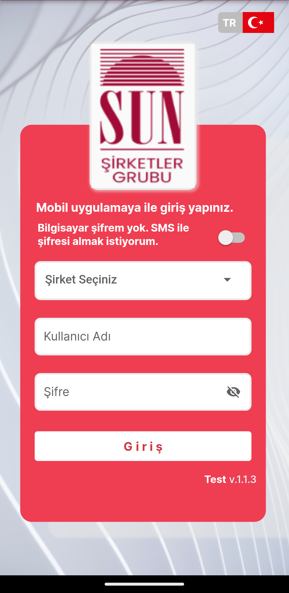
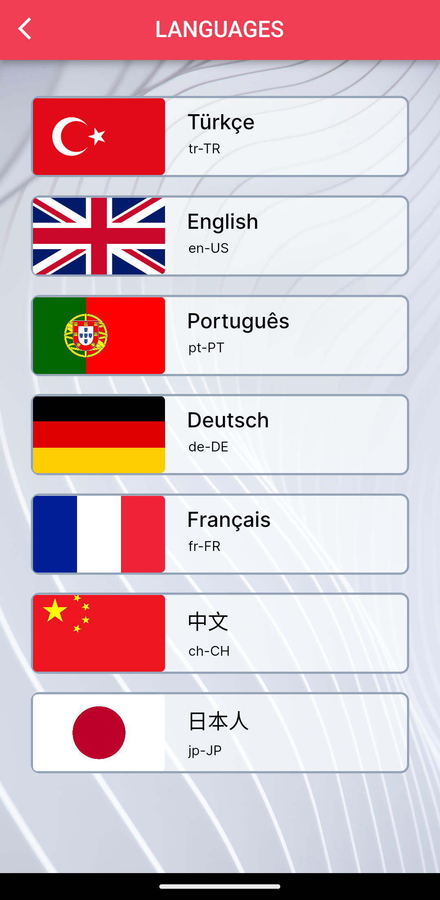
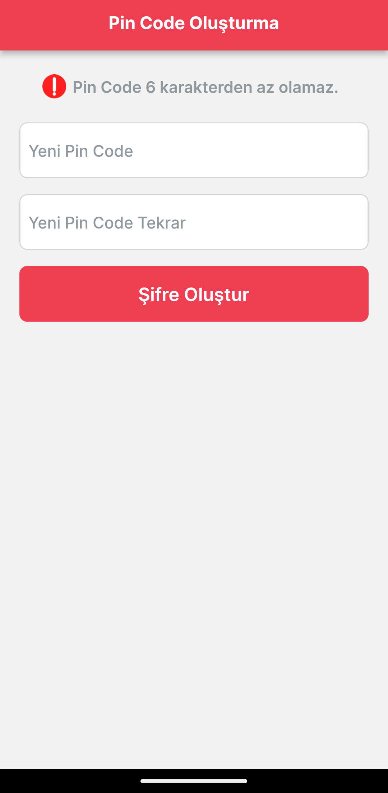
</p>

<p align="center">
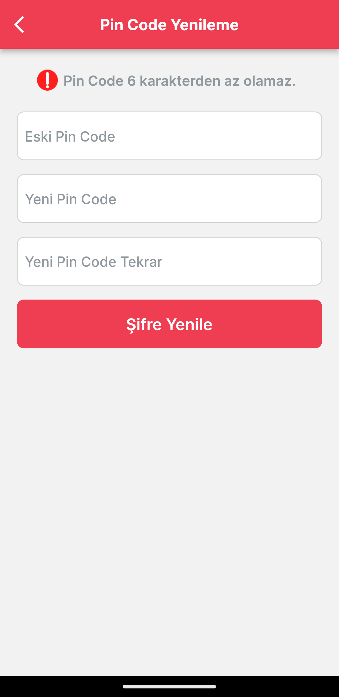
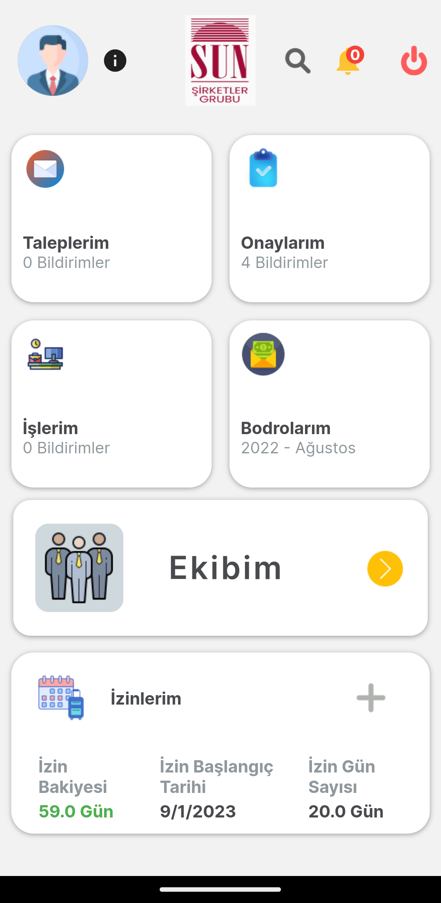
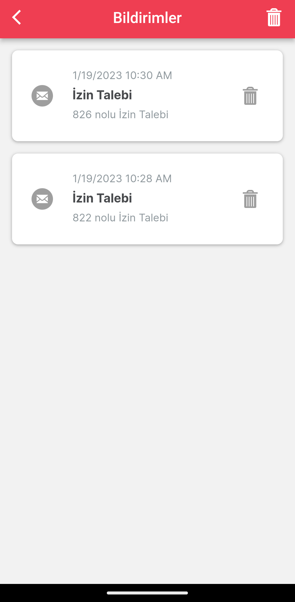
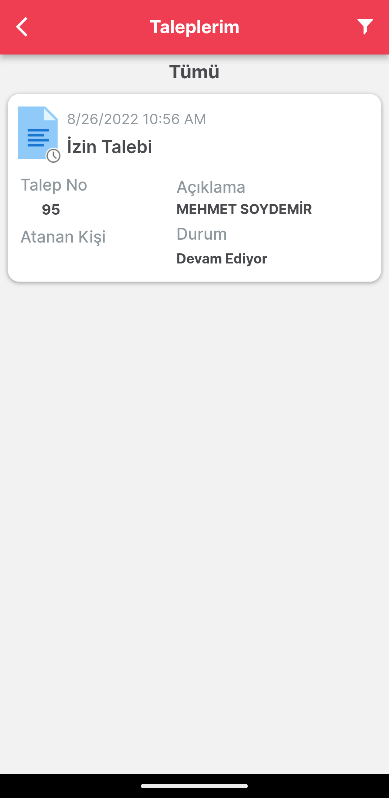
</p>

<p align="center">
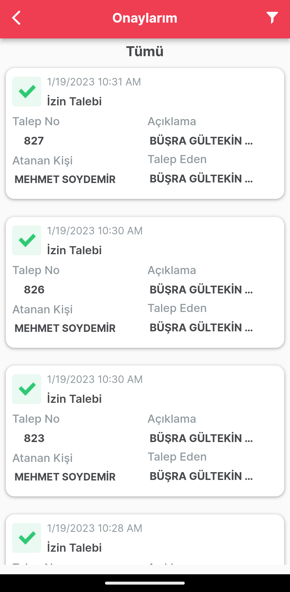
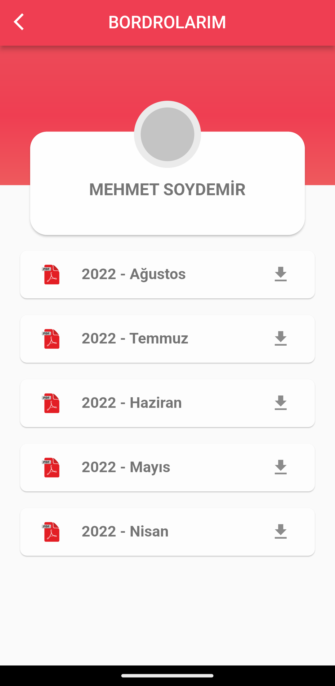

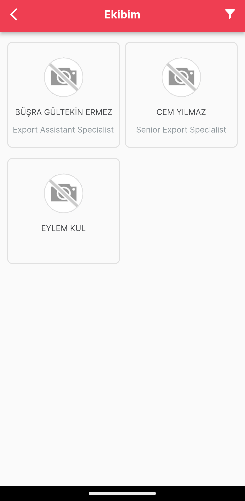
</p>

<p align="center">
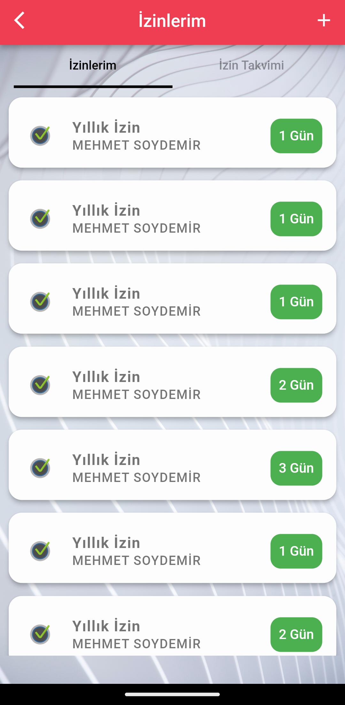
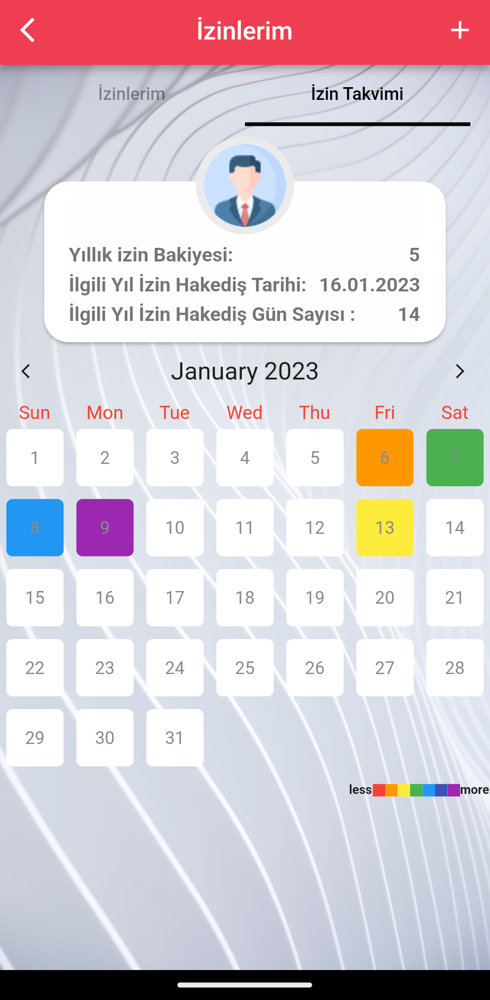
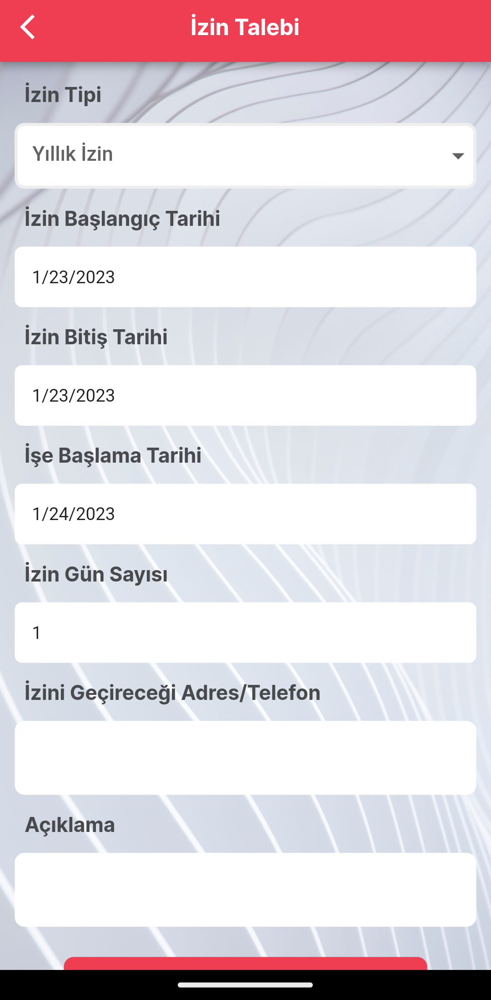
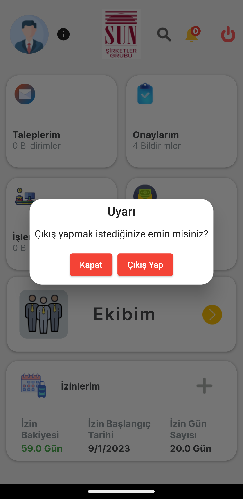
</p>
  
  
  
  
  
     